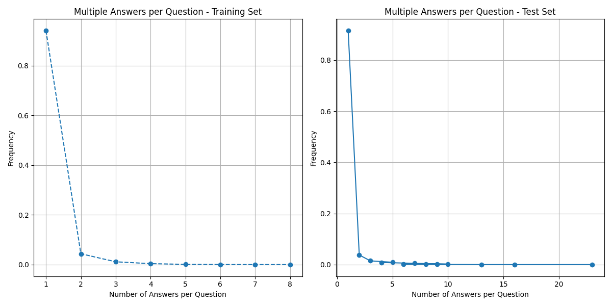
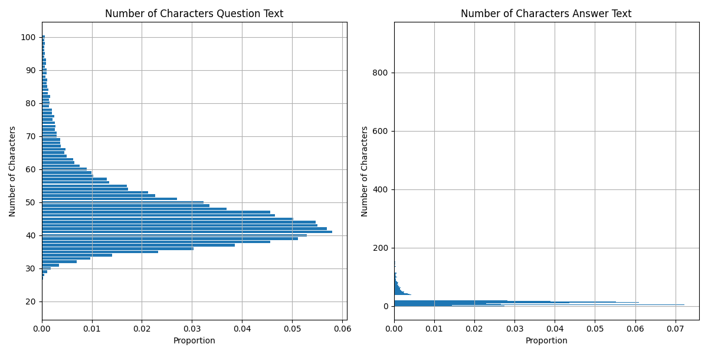

# MMIA-6021 Capstone Project

## Introduction

Question Answering -QA- is an important problem in current Natural Language Processing research, given the limitations of state-of-the-art Large Language Models -LLMs- to give accurate responses for domain knowledge (Hybl, 2024). 

The Natural Questions -NQ- dataset collected by Google, at the current date, has as its highest F1-Score a value of 0.6411 for short answer and 0.79823 for long answer, which pushes Google to declare the problem as still unresolved (Google AI, 2023). It is also important to consider that several investigations that seek to improve this score point out the importance of computation efficiency for QA given its limited knowledge compared to current LLMs (Lee, et al., 2020), (Rosa, et al., 2022), (Sawarkar, et al., 2024).

This project aims to produce a comprehensive use of a graduate level Natural Language Processing -NLP- course. In order to comply with this objective we use a Llama 3.1 with 7 billion parameters as base line, then we compute a Retrieval-Augmented Generation -RAG- model with the same Llama as it base model. 

## Dataset

Google AI provide two datasets one for training and another for test. The training dataset has a size of 43 GB with all of its information, the test set 3.5 GB. Each dataset is a JSON where each element is a selected question produced by humans and considered relevant by Google's team. Each element has a set of posible large and short answers. The short answer could be a yes or no answer, if so, this information is saved in a different key within the element. This structure poses a significant data wrangling challange even for a powerful server (check `Data Loading` section of our [Jupyter Notebook](https://github.com/DiegoDVillacreses/mmia_nlp_capstone/blob/main/nlp_final_project_dv_colab.ipynb)). For computational reasons we only select relevant information for short answers, structuring our JSON files into a Data Frame, the new train set has a size of 11.2 GB and test set 0.26 GB. Consider that each question could have multiple short answers as shown in the following graph, more than 91% of questions have only one answer and 95% two. 

Also consider the character lenght of questions and answers. As can be seen in the following graph most questions are between 40-60 characters, peaking at around 45 characters, its distribution shows that questions tend to be concise. On the other hand, the majority of answers are short, under 50 characters, but a few extend up to 800 characters, indicating some lengthy responses, but this are outliers. We can see that the questions are relatively consistent in length, but, answers are more variable, with a outliers.

## Methodology

## Bibliography

* Google AI. (2023). Natural questions. https://ai.google.com/research/NaturalQuestions
* Hybl, M. (2024). Comprehensive question and answer generation with llama 2.
* Lee, J., Sung, M., Kang, J., & Chen, D. (2020). Learning dense representations of phrases at scale. arXiv preprint, arXiv:2012.12624. https://arxiv.org/abs/2012.12624
* Rosa, G. M., Bonifacio, L., Jeronymo, V., Abonizio, H., Fadaee, M., Lotufo, R., & Nogueira, R. (2022). No parameter left behind: How distillation and model size affect zero-shot retrieval. arXiv preprint, arXiv:2206.02873. https://arxiv.org/abs/2206.02873
* Sawarkar, K., Mangal, A., & Solanki, S. R. (2024). Blended rag: Improving RAG (retriever-augmented generation) accuracy with semantic search and hybrid query-based retrievers. arXiv preprint, arXiv:2404.07220. https://arxiv.org/abs/2404.07220
