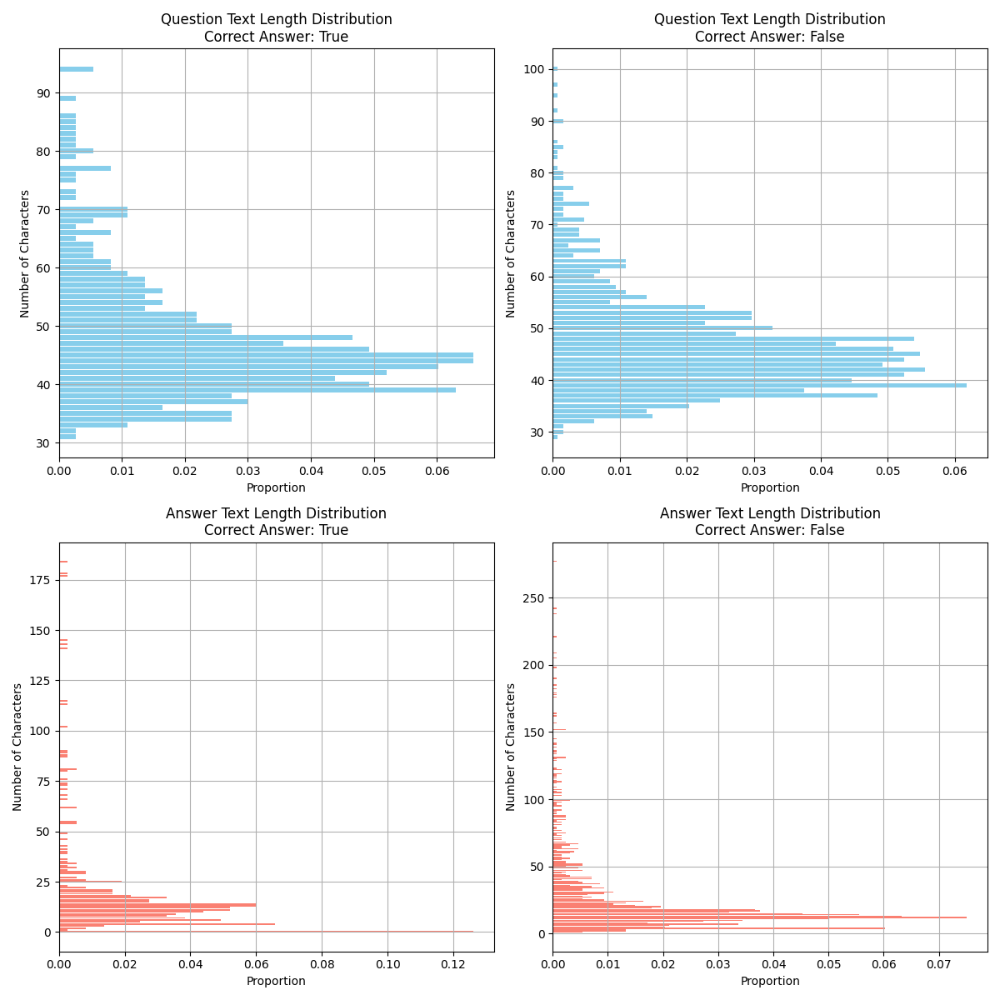

# MMIA-6021 Capstone Project

For the original repo go to:  [repo](https://github.com/DiegoDVillacreses/mmia_nlp_capstone/tree/main). For the GitHub Page go to: [page](https://diegodvillacreses.github.io/mmia_nlp_capstone/)


## Introduction

Question Answering -QA- is an important problem in current Natural Language Processing research, given the limitations of state-of-the-art Large Language Models -LLMs- to give accurate responses for domain knowledge (Hybl, 2024). 

The Natural Questions -NQ- dataset collected by Google, at the current date, has as its highest F1-Score a value of 0.6411 for short answer and 0.79823 for long answer, which pushes Google to declare the problem as still unresolved (Google AI, 2023). It is also important to consider that several investigations that seek to improve this score point out the importance of computation efficiency for QA given its limited knowledge compared to current LLMs (Lee, et al., 2020), (Rosa, et al., 2022), (Sawarkar, et al., 2024).

This project aims to produce a comprehensive use of a graduate level Natural Language Processing -NLP- course. In order to comply with this objective we use a Llama 3.1 with 7 billion parameters as base line, then we compute a Retrieval-Augmented Generation -RAG- model with the same Llama as it base model. 


## Dataset

Google AI provide two datasets one for training and another for test. The training dataset has a size of 43 GB with all of its information, the test set 3.5 GB. Each dataset is a JSON where each element is a selected question produced by humans and considered relevant by Google's team. Each element has a set of posible large and short answers. The short answer could be a yes or no answer, if so, this information is saved in a different key within the element. This structure poses a significant data wrangling challange even for a powerful server (check `Data Loading` section of our [Jupyter Notebook](https://github.com/DiegoDVillacreses/mmia_nlp_capstone/blob/main/nlp_final_project_dv_colab.ipynb)). For computational reasons we only select relevant information for short answers, structuring our JSON files into a Data Frame, the new train set has a size of 11.2 GB and test set 0.26 GB. Consider that each question could have multiple short answers as shown in the following graph, more than 91% of questions have only one answer and 95% two. 

<div style="text-align:center">

</div>

Also consider the character lenght of questions and answers. As can be seen in the following graph most questions are between 40-60 characters, peaking at around 45 characters, its distribution shows that questions tend to be concise. On the other hand, the majority of answers are short, under 50 characters, but a few extend up to 800 characters, indicating some lengthy responses, but this are outliers. We can see that the questions are relatively consistent in length, but, answers are more variable, with a outliers.

<div style="text-align:center">

</div>

## Methodology

### Large Language Models -LLMs-

LLMs are neural networks trained on large text corpora to perform language understanding and generation tasks. According to Qiao et al. (2023), LLMs have reached their complex stage mainly based on scaling model sizes, improving training techniques, and increasingly larger datasets. These models typically employ Transformer architectures which uses self-attention _memorize_ long-range dependencies in text.

LLMs are pre-trained using self-supervised learning objectives such as next-token prediction or masked language modeling, allowing them to learn from unlabeled data which is considerable more abundant than labeled data. Current LLMs have important limitations as: i) high computational requirements, ii) ethical concerns like bias and misinformation propagation, iv) interpretability, v) specific response capabilities. Given this last limitation, RAGs are gaining popularity.

### Retrieval-Augmented Generation

RAG is a framework that combines information retrieval techniques with generative models such as LLMs to enhance the accuracy of generated text. The LLM is conditioned to the input query and the external documents, which are retrieved from a large knowledge base. This integration has important advantages as the access of up-to-date information and improving responses for specific topics.

RAGs usually consist of a retriever and a generator. Where the retriever performs a similarity search in the embedding space to retrieve documents relevant to the input query. On the other hand, the generator produces the final output conditioned on both the input query and the context retrieved by the retriever. For this project, on the **retriever** side, we employ the `sentence-transformers/paraphrase-MiniLM-L6-v2` model to encode documents and queries into embeddings, this small model is used for computational reasons. The embeddings are managed using a FAISS vector database:

```python
modelPath = "sentence-transformers/paraphrase-MiniLM-L6-v2"
embeddings = HuggingFaceEmbeddings(
    model_name=modelPath,     
    model_kwargs={'device': device_name}, 
    encode_kwargs={'normalize_embeddings': False}
)
vector_db = FAISS.from_documents(google_data, embeddings)
retriever = vector_db.as_retriever()
```

The **generator** is the `meta-llama/Meta-Llama-3.1-8B-Instruct` model, a state of the art LLM:

```python
base_model = "meta-llama/Meta-Llama-3.1-8B-Instruct"
tokenizer = AutoTokenizer.from_pretrained(base_model)
model = AutoModelForCausalLM.from_pretrained(
    base_model,
    return_dict=True,
    low_cpu_mem_usage=True,
    torch_dtype=torch.float16,
    device_map="auto",
    trust_remote_code=True,
)
pipe = pipeline(
    "text-generation", 
    model=model, 
    tokenizer=tokenizer,
    max_new_tokens=120
)
llm = HuggingFacePipeline(pipeline=pipe)
```

The integration between the retriever and the generator is orchestrated using a famous prompt template `rag_prompt` (with over 16 million downloads) and a question-answering chain:

```python
rag_prompt = hub.pull("rlm/rag-prompt")
qa_chain = (
    {"context": retriever, "question": RunnablePassthrough()}
    | rag_prompt
    | llm
    | StrOutputParser()
)
```

This code is based on Kingabzpro (2023) with modifications to use a particular dataset, a smaller embedding, the newer Llama model a Hugging Face instead of Kaggle model repositories.

## Results

The computations are performed using a `NVIDIA A100` GPU with 40 GB of RAM and a overall system of 60 GB of RAM (A100 runtime type in Google Colab at september 2024). This setup seems impresive for our task, but, in practice numerous obstacles had to be overcome. From the selection of only short answers because when training for long answers the GPU ram collapses, to the selection of the embedding model and vector database in order to avoid ram collapse. For RAG we only used 30 thousand of 126 thousand traning samples for computational reasons, in order to find this value try and error where performed and subjectively selected after human revision of a hundred answers.

As a baseline we performed a simple prompt to our Llama 3.1 asking each of the test questions and provinding the corresponding corpora so the LLM could have the required information. Under this framework 1025 of 3288 samples collapsed the GPU ram and hence where not computable. A F1-Score of 0.443 where obtained after 135 minutes of computation. For our RAG model a 0.22 F1-Score where obtained after 132 minutes of model inference. This result is not consistent with state of the art RAG models such as Izacard, et al. (2023), where the authors find that a well crafted RAG is bastly superior to a LLM in speed and accuracy. Our RAG model should be improved in various features such as embedding model, tokenizer model, vector dabase and even general RAG architecture. As an interesting finding, lenght of question and answer does not seem to impact on correct answer for RAG model, this could be a good start point to improve our model.

<div style="text-align:center">

</div>


## Bibliography

* Google AI. (2023). Natural questions. https://ai.google.com/research/NaturalQuestions
* Hybl, M. (2024). Comprehensive question and answer generation with llama 2.
* Izacard, G., Lewis, P., Lomeli, M., Hosseini, L., Petroni, F., Schick, T., ... & Grave, E. (2023). Atlas: Few-shot learning with retrieval augmented language models. Journal of Machine Learning Research, 24(251), 1-43.
* Qiao, S., Yang, J., & Li, T. (2023). A Survey on Large Language Models. arXiv preprint arXiv:2303.18223.
* Kingabzpro. (2023). *Building RAG application using Llama 3*. Kaggle. https://www.kaggle.com/code/kingabzpro/building-rag-application-using-llama-3
* Lee, J., Sung, M., Kang, J., & Chen, D. (2020). Learning dense representations of phrases at scale. arXiv preprint, arXiv:2012.12624. https://arxiv.org/abs/2012.12624
* Rosa, G. M., Bonifacio, L., Jeronymo, V., Abonizio, H., Fadaee, M., Lotufo, R., & Nogueira, R. (2022). No parameter left behind: How distillation and model size affect zero-shot retrieval. arXiv preprint, arXiv:2206.02873. https://arxiv.org/abs/2206.02873
* Sawarkar, K., Mangal, A., & Solanki, S. R. (2024). Blended rag: Improving RAG (retriever-augmented generation) accuracy with semantic search and hybrid query-based retrievers. arXiv preprint, arXiv:2404.07220. https://arxiv.org/abs/2404.07220
